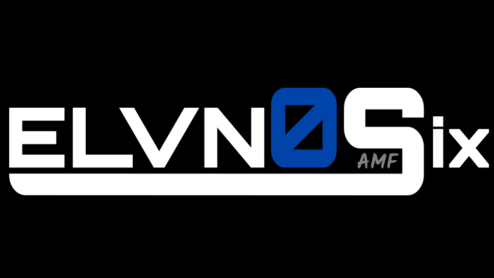

<!-- PROJECT LOGO -->
 

  

  <h3 align="center"><a href="https://play.google.com/store/apps/details?id=com.ElvnosixGames.BlindMazeMemoryLabyrinth">BLIND MAZE MEMORY LABYRINTH</a></h3>

  

    A MOBILE MAZE GAME WITH A TWIST
     
     
    <a href="https://github.com/Manjaka97/blind-maze-memory-labyrinth/issues">Report Bug or Request Feature</a>
  

<!-- TABLE OF CONTENTS -->
## Table of Contents

* [About the Project](#about-the-project)
* [Demo](#demo)
* [Features](#features)
* [Built With](#built-with)
* [Contact](#contact)

<!-- ABOUT THE PROJECT -->
## About The Project

![product-screenshot]
We know you can solve any maze, but can you do it when you cannot see the way?  
Test yourself in this new relaxing maze game, but do not relax too much and forget the way you came from!  
This is a casual puzzle game but it will effectively train your brain and increase your concentration. Enjoy the game!
Available on Google Play Store for Android: https://play.google.com/store/apps/details?id=com.ElvnosixGames.BlindMazeMemoryLabyrinth

<!-- DEMO -->
## Demo

![demo]

<!-- FEATURES -->
## Features

Simple and intuitive swipe control  
Start easy and increase difficulty  
No wifi and no internet connection required to play  
50 levels and will be continuously updated with new ones  
Simple minimalistic design  
Just a few levels everyday will keep your mind sharp

## Built With

* [Unity](https://unity.com/)

<!-- CONTACT -->
## Contact

* Manjaka Andriamasinoro 
* Email: manjaka.andriamasinoro@gmail.com / elvnosix@gmail.com
* LinkedIn: https://www.linkedin.com/in/manjaka-andriamasinoro/

* Project Link: [https://github.com/Manjaka97/blind-maze-memory-labyrinth/](https://github.com/Manjaka97/blind-maze-memory-labyrinth/)

<!-- MARKDOWN LINKS & IMAGES -->
[linkedin-url]: https://www.linkedin.com/in/manjaka-andriamasinoro/
[product-screenshot]: images/screenshot.png
[demo]: images/demo.gif